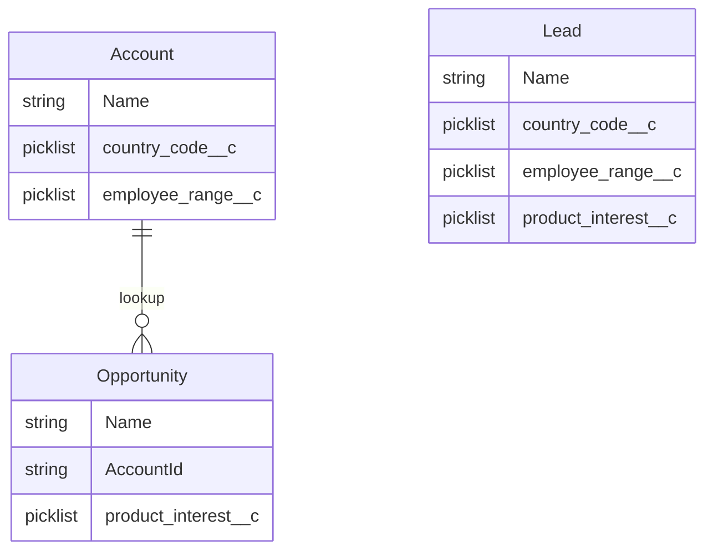
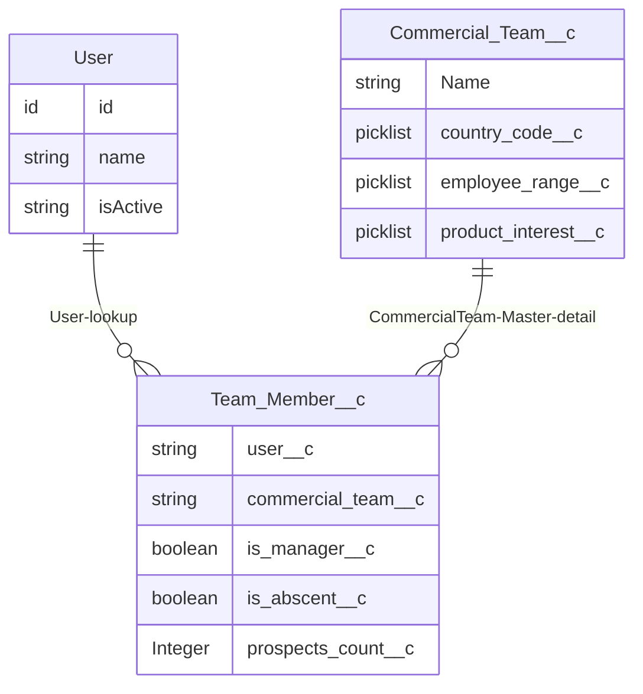
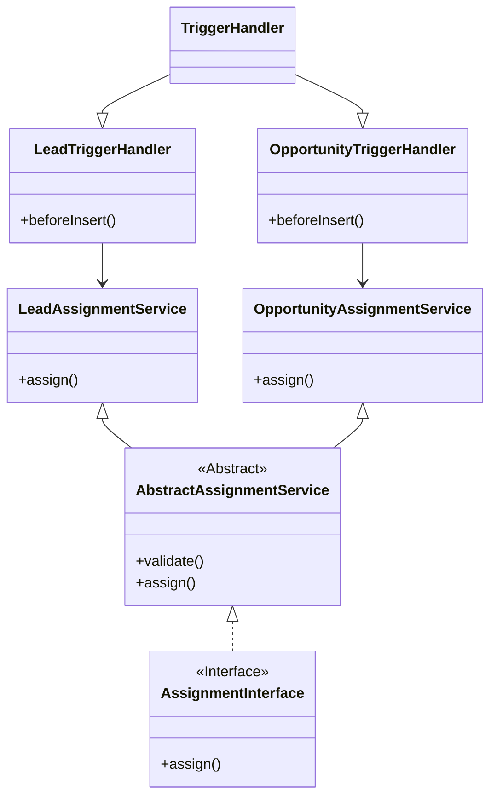

# Swile Study Case - Willian Paulino

# Deliverables
---
## 1 - Create a schema of the base data model (any tool of your choice)

Lead has all the fields necessary for the assignment logic. For opportunities, we get the contry code and employee range from Account and product interest from Opportunity, to run assignment logic.

---
## 2 - Create the required objects and fields (+ schema of those objects using your preferred tool)

Team_Member__c is a junction object between User and Commercial_Team__c, since one user can belong to multiple teams and one team can have multiple user, configuring a many-to-many relationship.

Team_Member__c is a detail of the Master Commercial_Team__c. Why? A team member can only exist if there is a team. No team no members. Master-detail is the appropriate relationship to represent this relation nature. Also, we don't want to leave orphan Team_Member__c records in the org, because they're useless and consume a limited storage. Additionaly, we can leverage roll-up summary feature (SUM, COUNT, MIN, MAX), which is usefull for managing teams and team member abscent end logic.

---

## 3. Implement the technical solution to fulfill the user stories: Apex Triggers, Apex Classes, Batch

### 3.1 Assignment Feature

This class diagram represents the architecture of the Assignment feature in Salesforce.

**TriggerHandler** is an abstract base class that defines common trigger handling behavior.

**LeadTriggerHandler** and **OpportunityTriggerHandler** extend TriggerHandler to implement object-specific logic.

Both **LeadAssignmentService** and **OpportunityAssignmentService** are concrete classes responsible for assigning records based on business rules.

These services inherit from **AbstractAssignmentService**, which provides shared logic and implements the **AssignmentInterface**.

The **AssignmentInterface** enforces the assign() method contract across all assignment services.

This design promotes separation of concerns, reusability of logic, and scalability for additional object-specific handlers and services.

---
### 3.2 Reassignment Feature

### 3.3 User's Absence Feature
---
# :ledger: Appendix
## 🔍 Sorting Strategy Justification

### 🔄 Sorting Problem

Each time a Lead is assigned to a Team Member, their `prospects_count__c` increases. This change can alter who has the lowest count in the team, potentially shifting the "next best" candidate for assignment.

To ensure fair distribution, the list of eligible Team Members must be **re-sorted after every assignment** based on the updated prospect counts.

I chose **Bubble Sort** over Quick Sort or other algorithms based on the specific constraints and characteristics of the use case:

### ✅ Why Bubble Sort?
- **Small Data Set**: Each commercial team has fewer than 20 members, making algorithmic complexity less significant.
- **Nearly Sorted Input**: After each assignment, the list of team members is almost sorted due to minor changes in `prospects_count__c`. Bubble Sort performs **very efficiently** in such scenarios thanks to its early-exit optimization.
- **Simplicity and Clarity**: The algorithm is easy to implement, understand, and maintain, ensuring future developers can quickly reason about the logic.

### ❌ Why Not Quick Sort?
- **Unnecessary Overhead**: Quick Sort introduces recursion and extra logic that isn't justified for small lists.
- **Not Adaptive**: It does not take advantage of the nearly sorted nature of the list.
- **Stack Depth Risk**: While not an immediate concern in this use case, recursive algorithms pose a potential risk of stack overflow.

### ⚖️ Conclusion
-  For this use case — **small, nearly sorted lists** — Bubble Sort provides better practical performance, improved readability, and easier maintainability than more complex alternatives.
---
# Salesforce DX Project: Next Steps

Now that you’ve created a Salesforce DX project, what’s next? Here are some documentation resources to get you started.

## How Do You Plan to Deploy Your Changes?

Do you want to deploy a set of changes, or create a self-contained application? Choose a [development model](https://developer.salesforce.com/tools/vscode/en/user-guide/development-models).

## Configure Your Salesforce DX Project

The `sfdx-project.json` file contains useful configuration information for your project. See [Salesforce DX Project Configuration](https://developer.salesforce.com/docs/atlas.en-us.sfdx_dev.meta/sfdx_dev/sfdx_dev_ws_config.htm) in the _Salesforce DX Developer Guide_ for details about this file.

## Read All About It

- [Salesforce Extensions Documentation](https://developer.salesforce.com/tools/vscode/)
- [Salesforce CLI Setup Guide](https://developer.salesforce.com/docs/atlas.en-us.sfdx_setup.meta/sfdx_setup/sfdx_setup_intro.htm)
- [Salesforce DX Developer Guide](https://developer.salesforce.com/docs/atlas.en-us.sfdx_dev.meta/sfdx_dev/sfdx_dev_intro.htm)
- [Salesforce CLI Command Reference](https://developer.salesforce.com/docs/atlas.en-us.sfdx_cli_reference.meta/sfdx_cli_reference/cli_reference.htm)
