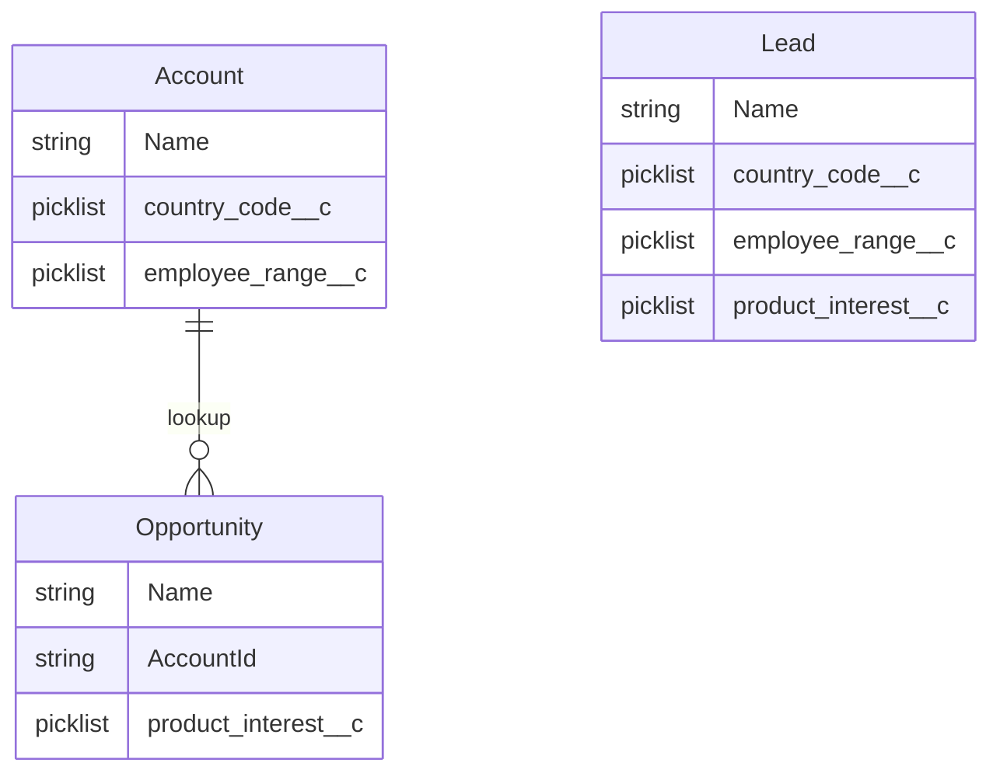
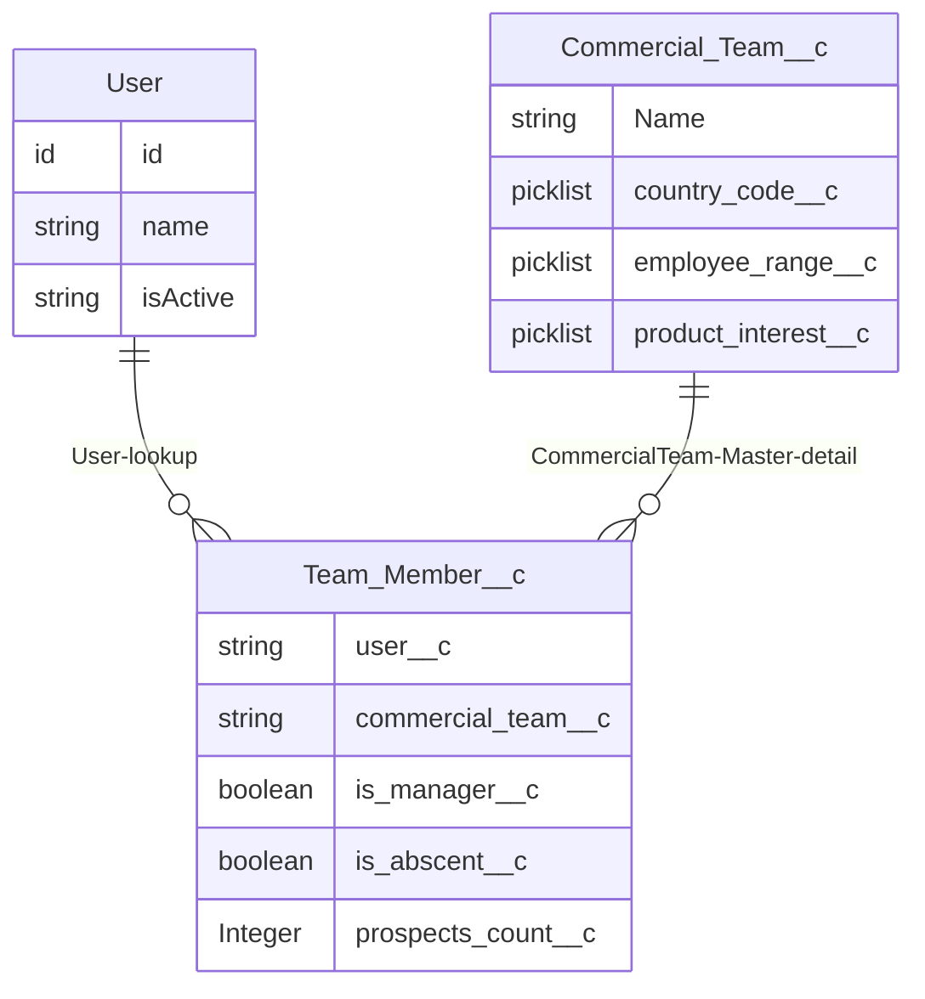
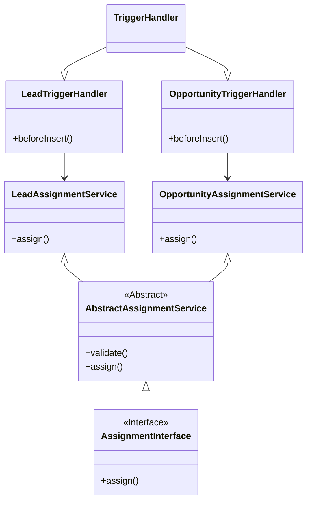
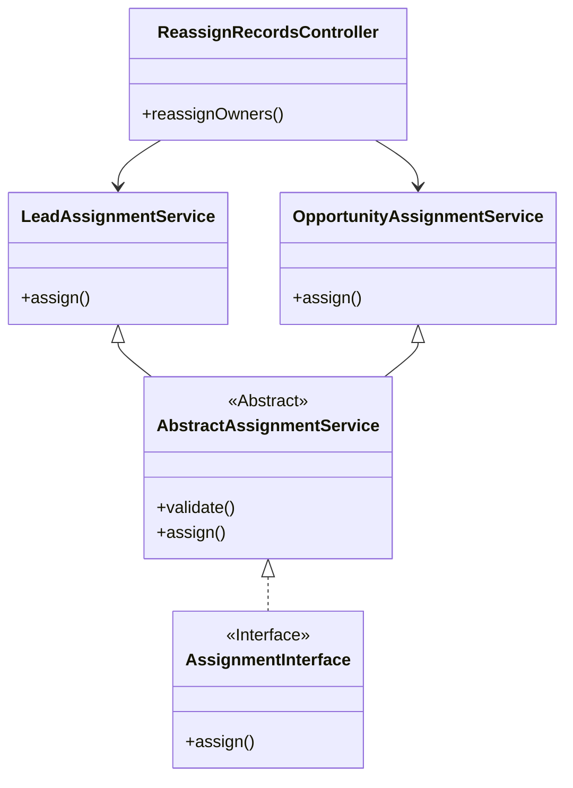
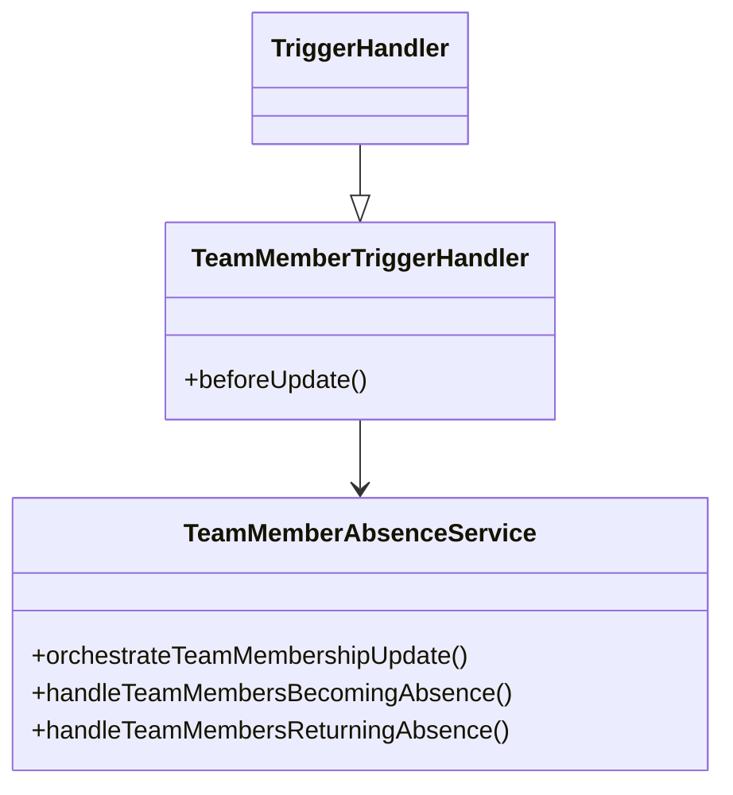
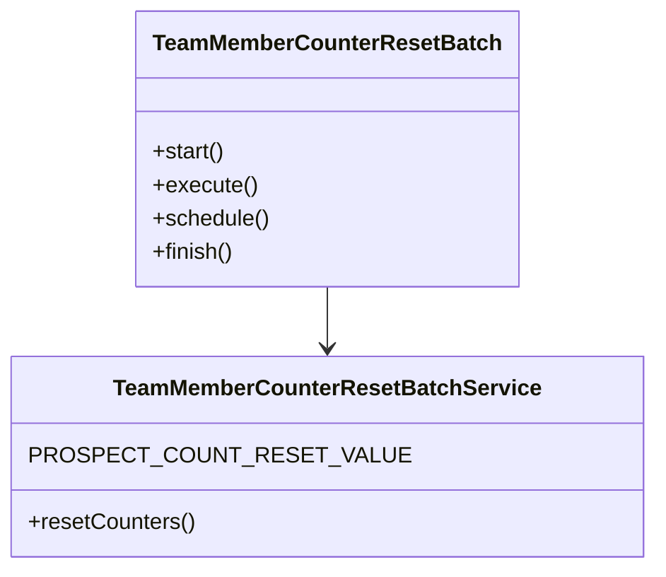

# Swile Study Case - Willian Paulino
---
## Case Description

Swile’s sales organization aims to sign contracts for each product.
Salespeople (Users) are on Salesforce and work with Leads and Opportunities.

They are grouped into commercial teams, each composed of one or more Sales.

They are responsible for selling products to prospects (Lead, or directly Account).

### ▶ Current setup ▶
When a Lead or Opportunity is created, or a reassignment request is made:
1. A manager opens the Lead or Opportunity;
2. Reviews the employee range, country, and product of interest;
3. Identifies the appropriate team for this Lead or Opportunity;
4. Within the team, finds the user who has received the fewest Leads or Opportunities
recently;
5. Checks that the user is not absent;
6. Once the user is identified, the manager manually updates the record owner.
### 🛑 Problem 🛑
Assigning all these objects manually is time-consuming and error-prone.

**↖ Features ↗**
1. As soon as a Lead or Opportunity is created, or the “Reassign” button is clicked,
the object must be automatically and fairly distributed within the appropriate team
based on employee range, country, and product of interest.
The right user is the one who has received the fewest leads or opportunities in their
team.
2. A User can belong to multiple teams.
3. If a User is absent, they should not receive leads or opportunities.
4. When a User returns from absence, their counters should be aligned with the highest
counters in each of their teams.
5. A User with “manager” rights can declare users absent in Salesforce.
6. At the end of each month, each User's counters must be reset to 0.


### 🟢 Deliverables 🟢
Via a Salesforce Trailhead organization:
1. Create a schema of the base data model (any tool of your choice)
2. Create the required objects and fields (+ schema of those objects using your preferred
tool)
3. Implement the technical solution to fulfill the user stories: Apex Triggers, Apex Classes,
Batch
4. (Bonus) On the home page, create a Lightning Web Component to let managers view
their team members and easily update their availability (present/absent)
---
### 📜 Appendix 📜
#### Base setup
**User**
- Can belong to one or several teams
- Can be a “Manager”: with this role, they can mark users as “absent” (on leave or sick
leave) in Salesforce and indicate their return

**Lead**
- Represents the company being prospected for a product sale
- Has several custom fields, including:
○ `employee_range__c`
- Definition: company size range by number of employees
- Type: Picklist
- Values:
- ‘1 - 100’
- ‘101 - 500’
- ‘501+’
○ `product_interest__c`
- Definition: the product the prospect is interested in
- Type: Picklist
- Values:
- ‘Meal Voucher’ (France)
- ‘Gift’ (France)
- ‘Travel’ (France)
- ‘Incentivos’ (Brazil)
- ‘Beneficios’ (Brazil)
- ‘Natal’ (Brazil)
○ `country_code__c`
- Definition: the country code where the prospect’s company is based
- Type: Picklist
- Values:
- ‘BR’ (Brazil)
- ‘FR’ (France)

**Account**
- Represents the company being prospected
- Has several custom fields, including:
○ `employee_range__c`
- Same definition and values as above
○ `country_code__c`
- Same definition and values as above
- An account can have one or more opportunities (only one opportunity per product can be
open at a time)

**Opportunity**
- Represents the product to be sold to the company
- Has fields including:
○ `product_interest__c`
- Same definition and values as for Lead

**Commercial Team**
- Not a default object in Salesforce setup
- Groups several Salesforce users
- Is mono-product (dedicated to one product only)
- Sells to a specific employee range only (‘1 - 100’, ‘101 - 500’, ‘+501’)
- Belongs to one country (‘FR’, ‘BR’)

---

# Case Solution - Deliverables
---
## 1 - Create a schema of the base data model (any tool of your choice)

Lead has all the fields necessary for the assignment logic. For opportunities, we get the contry code and employee range from Account and product interest from Opportunity, to run assignment logic.

---
## 2 - Create the required objects and fields (+ schema of those objects using your preferred tool)

`Team_Member__c` is a junction object between `User` and `Commercial_Team__c`, since one user can belong to multiple teams and one team can have multiple user, configuring a many-to-many relationship.

`Team_Member__c` is a **detail** of the **Master** `Commercial_Team__c`. Why? A team member can only exist if there is a team. No team, no members. Master-detail is the appropriate object relationship to represent this relation nature. Also, we don't want to leave orphan Team_Member__c records in the org, because they're useless in that state and consume a limited and expansive storage. Additionaly, we can leverage roll-up summary feature (SUM, COUNT, MIN, MAX), which is usefull for managing teams and team member abscent end logic.


---

## 3. Implement the technical solution to fulfill the user stories: Apex Triggers, Apex Classes, Batch

### 3.1 Assignment Feature

This class diagram represents the architecture of the Assignment feature in Salesforce.

**TriggerHandler** is an abstract base class that defines common trigger handling behavior.

**LeadTriggerHandler** and **OpportunityTriggerHandler** extend TriggerHandler to implement object-specific logic.

Both **LeadAssignmentService** and **OpportunityAssignmentService** are concrete classes responsible for assigning records based on business rules.

These services inherit from **AbstractAssignmentService**, which provides shared logic and implements the **AssignmentInterface**.

The **AssignmentInterface** enforces the assign() method contract across all assignment services.

This design promotes separation of concerns, reusability of logic, and scalability for additional object-specific handlers and services.

**Classes Diagram**


#### Assignment Logic Within Both Services
    1 - Retrieve all commercial teams and its members
    2 - Build comercial teams Maps with a composite key (Country Code + Product Interest + Employee Range)
    3 - Iterate over Trigger Records, building the lead / opportunity composite key (following the same rules of commercial teams composite key)
        4 - Get the right team for the lead / opportunity using the composite key
        5 - Sort the team members ascending based on prospects counter
        6 - Assign the lead / opportunity to the not absent team member with the fewest prospects count.
        7 - Add 1 to its prospects counter.
---
### 3.2 Reassignment Feature
The reassignment feature reuses the existing Assignment Service implemented in both the Opportunity and Lead triggers. The key difference is that, instead of being triggered by DML operations, the service is invoked through a Lightning Web Component (**LWC**) of type **Action**. This LWC is executed when the user clicks the **Reassign** button on the record page.

**Classes Diagram**

#### Reassignment Logic For Both Opportunity / Lead
    1 - Retrieve all commercial teams and its members
    2 - Build comercial teams Maps with a composite key (Country Code + Product Interest + Employee Range)
    3 - Iterate over Opportunity / Lead Records, building the lead / opportunity composite key (following the same rules of commercial teams composite key)
        4 - Get the Last Owner Team Member and subtract 1 from its prospects counter.
        5 - Get the right team for the lead / opportunity using the composite key
        6 - Sort the team members ascending based on prospects counter
        7 - Assign the lead / opportunity to the not absent team member with the fewest prospects count.
        8 - Add 1 to its prospects counter.

Note that although the **Reassign** button handles one record at a time, the reassignment logic is fully bulkified. This means the solution is designed to support both single and multiple record reassignments efficiently

---

### 3.3 User's Absence Feature

The absence feature ensures users marked as unavailable are excluded from receiving new Lead or Opportunity assignments. This is controlled via the `Is_Absent__c` field on each user's `Team_Member__c` records, which represent their membership across different sales teams.

#### Marking as Absent:
Managers can update a user's status to absent, which excludes them from future assignment logic across all teams. They manage their user's absence from the commercial team record page. If the manager mark a given team member as absent, the system:
```
    1 - Will get all the team member records related to this user. This set of records represent the user's team membership.
    2 - Set the user's team membership as absent.
    3 - Update the user's team membership.
```

That gives flexibility for the manager. It does not matter what user's team member record the manager mark as absent. This update will be spread for the user's team membership. 

**Example:** 

The manager mark the John Doe's Team Member record of the `FR - Insides - Sales - Meal Voucher (1-100)` team as Absent.

John Doe is also part of the `FR - KAM - Sales - Gift (+501)` and `FR - KAM - Sales - Travel (+501)`. That means that the John Doe has 3 Team_Member__c records. One of them its marked as absent by the manager, but what about the others John Doe's Team_Member__c records? 

They are retrieved in the `Team_Member__c` trigger, and updated as absent in the before update.

#### Returning from Absence:
When a user's `Is_Absent__c` field is updated from true to false, the system:

Automatically updates all of their `Team_Member__c` records to mark them as present.

Sets each record's `Prospect_Count__c` to match the highest count within the corresponding team, ensuring fairness.

#### Trigger Logic and Recursion Control:

The team membership updates are performed within a before update trigger.

To prevent recursive trigger execution, a `static flag` in the **TriggerRecursionControl** class is used:

```

public with sharing class TriggerRecursionControl {
    public static Boolean isFirstRun = true;
}
```
```
trigger TeamMemberTrigger on Team_Member__c (before update) {

    if (!TriggerRecursionControl.isFirstRun) return;

    TriggerRecursionControl.isFirstRun = false;

    new TeamMemberTriggerHandler().run();
}
```
This ensures that the trigger logic only executes once per transaction.

This design maintains fairness in workload distribution and supports bulk-safe trigger execution without needing asynchronous processing. Remember the team's data model in the section 2 to visualize the user's team membership.

**Classes Diagram**



---

### 3.4 User's Monthly Counter Reset Feature

To maintain fairness in prospect distribution, each user's prospects_count__c value is reset to 0 at the start of every month.

#### ⚙️ Implementation
This feature is implemented using a batch class `TeamMemberCounterResetBatch` and a service class `TeamMemberCounterResetBatchService`.

**The batch class:**

Implements both `Database.Batchable<SObject>` and `Schedulable` interfaces.

Resets the counter for all `Team_Member__c` records using a SOQL query.

**🕒 Schedule**
The batch is scheduled via the static method `TeamMemberCounterResetBatch.scheduleBatch()`, which sets the CRON trigger to:

```

0 0 1 * *
```

This ensures the reset occurs at midnight (00:00) of the first day of each month, immediately after the last moment (11:59 PM) of the previous month.

**The service class:**

Contains the `resetCounters()` method, which sets each `Team_Member__c.prospects_count__c` to 0.

Performs a bulk update operation to apply the reset efficiently.


This design ensures a clean monthly reset cycle without any manual intervention.


---
### 3.5 User's Absence Declaration Permission Control
The Team_Member__c.is_absent__c field is not editable for all profiles.

Using the permission set group **Commercial Teams Manager** I grant permission to edit the `Team_Member__c.is_absent__c` field to the managers.

---
# :ledger: Appendix
## 🔍 Sorting Strategy Justification

### 🔄 Sorting Problem

Each time a Lead is assigned to a Team Member, their `prospects_count__c` increases. This change can alter who has the lowest count in the team, potentially shifting the "next best" candidate for assignment.

To ensure fair distribution, the list of eligible Team Members must be **re-sorted after every assignment** based on the updated prospect counts.

I chose **Bubble Sort** over Quick Sort or other algorithms based on the specific constraints and characteristics of the use case:

### ✅ Why Bubble Sort?
- **Small Data Set**: Each commercial team has fewer than 20 members, making algorithmic complexity less significant.
- **Nearly Sorted Input**: After each assignment, the list of team members is almost sorted due to minor changes in `prospects_count__c`. Bubble Sort performs **very efficiently** in such scenarios thanks to its early-exit optimization.
- **Simplicity and Clarity**: The algorithm is easy to implement, understand, and maintain, ensuring future developers can quickly reason about the logic.

### ❌ Why Not Quick Sort?
- **Unnecessary Overhead**: Quick Sort introduces recursion and extra logic that isn't justified for small lists.
- **Not Adaptive**: It does not take advantage of the nearly sorted nature of the list.
- **Stack Depth Risk**: While not an immediate concern in this use case, recursive algorithms pose a potential risk of stack overflow.

### ⚖️ Conclusion
-  For this use case — **small, nearly sorted lists** — Bubble Sort provides better practical performance, improved readability, and easier maintainability than more complex alternatives.
---
# Salesforce DX Project: Next Steps

Now that you’ve created a Salesforce DX project, what’s next? Here are some documentation resources to get you started.

## How Do You Plan to Deploy Your Changes?

Do you want to deploy a set of changes, or create a self-contained application? Choose a [development model](https://developer.salesforce.com/tools/vscode/en/user-guide/development-models).

## Configure Your Salesforce DX Project

The `sfdx-project.json` file contains useful configuration information for your project. See [Salesforce DX Project Configuration](https://developer.salesforce.com/docs/atlas.en-us.sfdx_dev.meta/sfdx_dev/sfdx_dev_ws_config.htm) in the _Salesforce DX Developer Guide_ for details about this file.

## Read All About It

- [Salesforce Extensions Documentation](https://developer.salesforce.com/tools/vscode/)
- [Salesforce CLI Setup Guide](https://developer.salesforce.com/docs/atlas.en-us.sfdx_setup.meta/sfdx_setup/sfdx_setup_intro.htm)
- [Salesforce DX Developer Guide](https://developer.salesforce.com/docs/atlas.en-us.sfdx_dev.meta/sfdx_dev/sfdx_dev_intro.htm)
- [Salesforce CLI Command Reference](https://developer.salesforce.com/docs/atlas.en-us.sfdx_cli_reference.meta/sfdx_cli_reference/cli_reference.htm)
